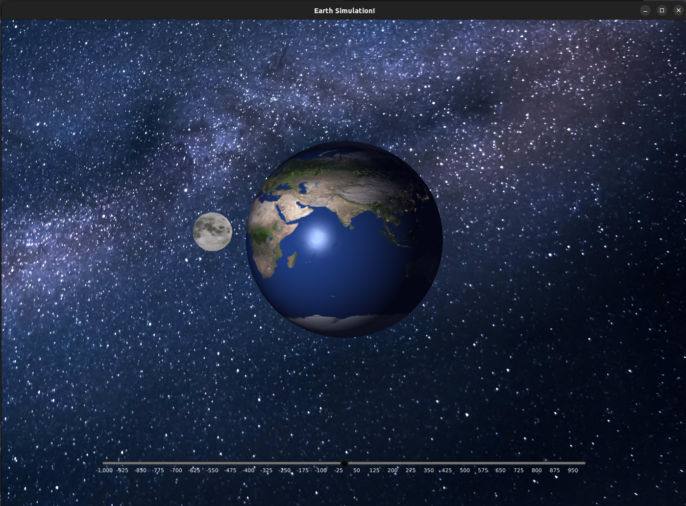

# EarthSimulation

This is a simple 3D earth and moon simulation made using JavaFX. The Earth is made simply using JvaFX's Sphere and PhongMaterial classes, this includes using a self ilumination, bump, secular, and diffuse maps. The moon is created in a similar way.

The scene can be interacted with by rotating it using the mouse or the arrow keys, there also has a zoom feature with can minipulated using the slider at the bottom of the window or using the '-' and '+' keys. 
